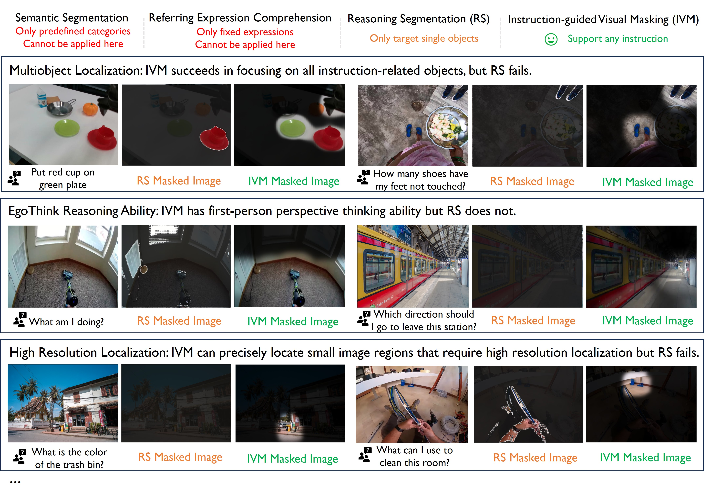

# Instruction-Guided Visual Masking

[[📚paper]](https://arxiv.org/abs/2405.19783) [[project page]](https://2toinf.github.io/IVM/) [[🤗Dataset]](https://huggingface.co/datasets/2toINF/IVM-Mix-1M/tree/main)
[[🤗model]](https://huggingface.co/2toINF/IVM/tree/main)
### 🔥News [2024.09.26] IVM has been accepted by NeurIPS 2024

### 🔥News [2024.07.21] IVM has been selected as outstanding paper at MFM-EAI workshop @ICML2024

## Introduction

We introduce Instruction-guided Visual Masking (IVM), a new versatile visual grounding model that is compatible with diverse multimodal models, such as LMM and robot model. By constructing visual masks for instruction-irrelevant regions, IVM-enhanced multimodal models can effectively focus on task-relevant image regions to better align with complex instructions. Specifically, we design a visual masking data generation pipeline and create an IVM-Mix-1M dataset with 1 million image-instruction pairs. We further introduce a new learning technique, Discriminator Weighted Supervised Learning (DWSL) for preferential IVM training that prioritizes high-quality data samples. Experimental results on generic multimodal tasks such as VQA and embodied robotic control demonstrate the versatility of IVM, which as a plug-and-play tool, significantly boosts the performance of diverse multimodal models.



<p align="center">
    
    
    
    
    
</p>
<p align="center">
 <em> Duck on green plate</em> |  <em>Red cup on red plate</em>  |  <em>Red cup on red plate</em>  |  <em>Red cup on silver pan </em> |  <em>Red cup on silver pan</em>
</p>

## Content

* [Quick Start](#quick-start)
* [Model Zoo](#quick-start)
* [Datasets](#quick-start)

## Quick Start

### Install

1. Clone this repository and navigate to IVM folder

```bash
git clone https://github.com/2toinf/IVM.git
cd IVM
```

2. Install Package

```bash
conda create -n IVM python=3.10 -y
conda activate IVM
pip install -e .
```

### Usage

```python
from IVM import load, forward_batch
ckpt_path = "IVM-V1.0.bin" # your model path here
model = load(ckpt_path, low_gpu_memory = False) # Set `low_gpu_memory=True` if you don't have enough GPU Memory
image = Image.open("image/demo/robot.jpg") # your image path
instruction = "pick up the red cup and place it on the green pan" 
result = forward_batch(model, [image], [instruction], threshold = 0.99)
from matplotlib import pyplot as plt
import numpy as np
plt.imshow((result[0]).astype(np.uint8))
```

For more intresting cases, please refer to [demo.ipynb](demo.ipynb)


## Model Zoo

| Models   |basemodel |  Params<br />(M) | Iters | ckpt                                                                              |
| --------- | --------- | --------------- | ----- | ------------------------------------------------------------------------------------------ |
|  IVM-V1.0  | LLava-1.5-7B + SAM-H  |  64M     | 1M |  [HF-link](https://huggingface.co/2toINF/IVM/tree/main)

We welcome everyone to further explore more IVM training methods and further scale it up!.


## Evaluation

Please first preprocess the test images using our IVM model, then follow the official instructions for evaluation.

### VQA-type benchmarks

V* Bench: [https://github.com/penghao-wu/vstar?tab=readme-ov-file#evaluation](https://github.com/penghao-wu/vstar?tab=readme-ov-file#evaluation)

Traditional VQA benchmark: [https://github.com/haotian-liu/LLaVA?tab=readme-ov-file#evaluation](https://github.com/haotian-liu/LLaVA?tab=readme-ov-file#evaluation)

### Real-Robot

Policy Learning: [https://github.com/Facebear-ljx/BearRobot](https://github.com/Facebear-ljx/BearRobot)

Robot Infrastructure: [https://github.com/rail-berkeley/bridge_data_robot](https://github.com/rail-berkeley/bridge_data_robot)

## IVM-Mix-1M Dataset

Please download the annotations of our [IVM-Mix-1M](https://huggingface.co/datasets/2toINF/IVM-Mix-1M/tree/main). We provide over 1M image-instruction pairs with corresponding mask labels. Our IVM-Mix-1M dataset consists of three part: [HumanLabelData](https://huggingface.co/datasets/2toINF/IVM-Mix-1M/blob/main/HumanLabelData.zip), [RobotMachineData](https://huggingface.co/datasets/2toINF/IVM-Mix-1M/blob/main/RobotMachineData.zip) and [VQAMachineData]. For the `HumanLabelData` and  `RobotMachineData`, we provide well-orgnized images, mask label and language instructions. For the `VQAMachineData`, we only provide mask label and language instructions and please download the images from constituting datasets.

- COCO: [train2017, train2014](http://images.cocodataset.org/)
- GQA: [images](https://downloads.cs.stanford.edu/nlp/data/gqa/images.zip)
- TextVQA: [train_val_images](https://dl.fbaipublicfiles.com/textvqa/images/train_val_images.zip)
- VisualGenome: [part1](https://cs.stanford.edu/people/rak248/VG_100K_2/images.zip), [part2](https://cs.stanford.edu/people/rak248/VG_100K_2/images2.zip)
- Flickr30k: [homepage](https://shannon.cs.illinois.edu/DenotationGraph/)
- Open images: [download script](https://github.com/cvdfoundation/open-images-dataset#download-images-with-bounding-boxes-annotations), **we only use 0-5 splits**
- VSR: [images](https://www.dropbox.com/s/0s3bj25s62crjh2/vsr_images.zip?dl=0)

After downloading all of them, organize the data as follows,

```
├── coco
│   └── train2017
│   └── train2014
├── gqa
│   └── images
├── textvqa
│   └── train_images
└── vg
│   ├── VG_100K
│   └── VG_100K_2
└── flickr30k
│   └── images
└── vsr
└── openimages
```

We provide a sample [code](IVM_1M_Mix/datareader.py) for reading data as a reference.


## Acknowledgement

This work is built upon the [LLaVA](https://github.com/haotian-liu/LLaVA) and [SAM](https://github.com/facebookresearch/segment-anything) and [LISA](https://github.com/dvlab-research/LISA).

## Citation

```
@article{zheng2024instruction,
  title={Instruction-Guided Visual Masking},
  author={Zheng, Jinliang and Li, Jianxiong and Cheng, Sijie and Zheng, Yinan and Li, Jiaming and Liu, Jihao and Liu, Yu and Liu, Jingjing and Zhan, Xianyuan},
  journal={arXiv preprint arXiv:2405.19783},
  year={2024}
}
  
```
